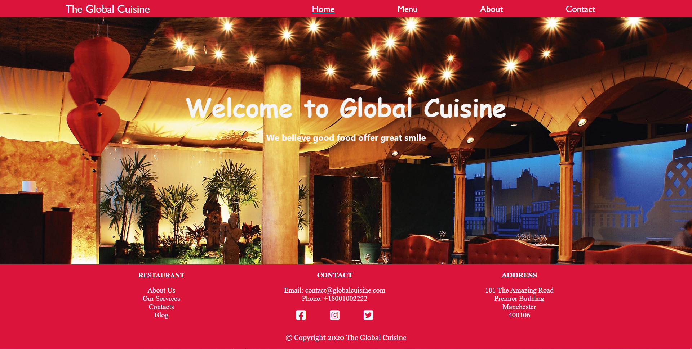
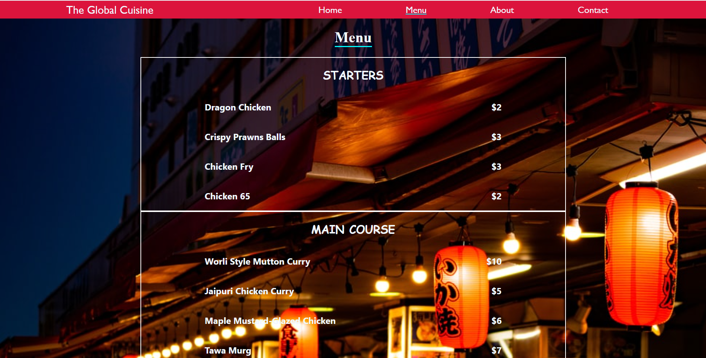
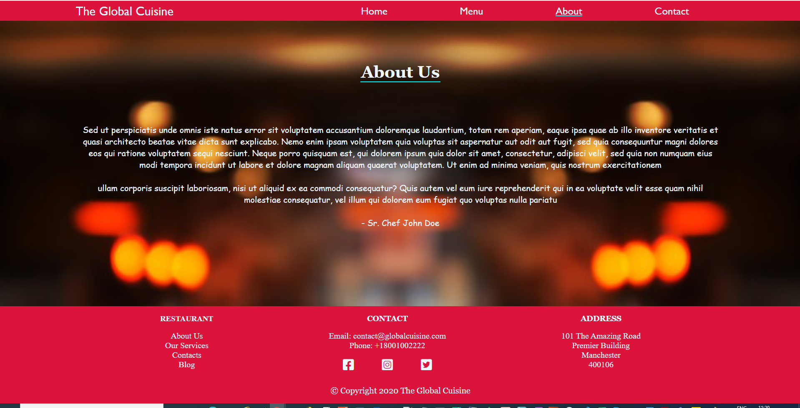
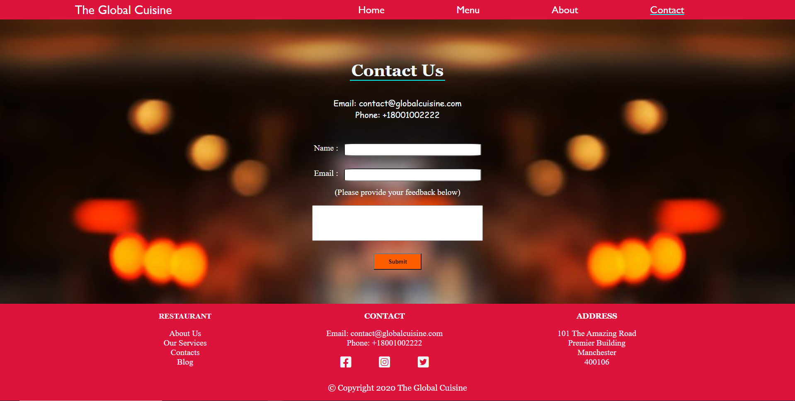

# Restaurant Application using Javascript

> A Restaurant page developed using Javascript and webpack as modules bundler

Restaurant project is to display how to use ES6 modules and setup application using webpack.

## Built With

- HTML,
- CSS,
- JavaScript,
- Webpck

## Live Demo

[Live Demo Link](https://livedemo.com)

### Prerequisites
- Any kind of browser supporting CSS3 and HTML5

### Setup
- Fork the repo to your remote repository.
- Clone or download the repository to your local machine.

### Install
- No istallation required.

### Running the Project
- Access the index.html in the dist folder and open it in your browser.
- Change the various pages by clicking the nav bar links

## Authors

👤 **Rajkumar Das**

- Github: [@rajkumardas2701](https://github.com/rajkumardas2701)
- Twitter: [@Rajkuma58621299](https://twitter.com/Rajkuma58621299)
- Linkedin: [Rajkumar Das](https://www.linkedin.com/in/rajkumar-das-41308961/)

## 🤝 Contributing

Contributions, issues and feature requests are welcome!

Feel free to check the [issues page](https://github.com/rajkumardas2701/Restaurant_JS/issues).

## Show your support

Give a ⭐️ if you like this project!

## 📝 License

This project is [MIT](lic.url) licensed.
